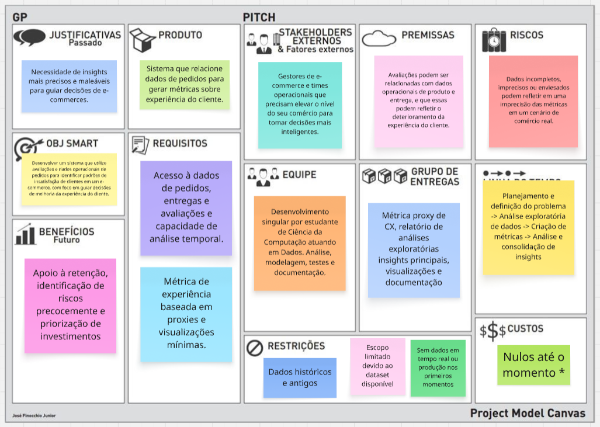

# CX Analytics Engine

Este projeto tem como objetivo analisar a experiência dos clientes de e-commerces explorando dados de pedido, entregas e avaliações para entender fatores que implicam na insatisfação do cliente e percepção dos serviços.

O objetivo é que o projeto explore a área de Dados de uma forma expansiva e que continue em constante desenvolvimento e melhora com base no que é tangível.

## Objetivos do Projeto

- Analisar padrões de tempo de entrega (Contraste entre tempo estimado e tempo real)
- Investigar relação de dados operacionais e avaliações dos clientes
- Entregar métrica de satisfação para insights de melhorias a serem feitas.
- Criar base sólida para análises preditivas e NLP.

